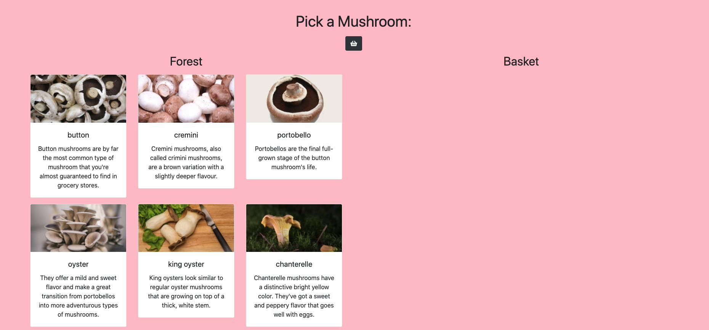
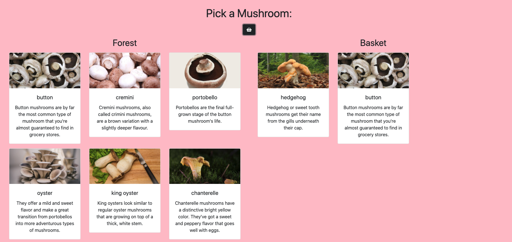
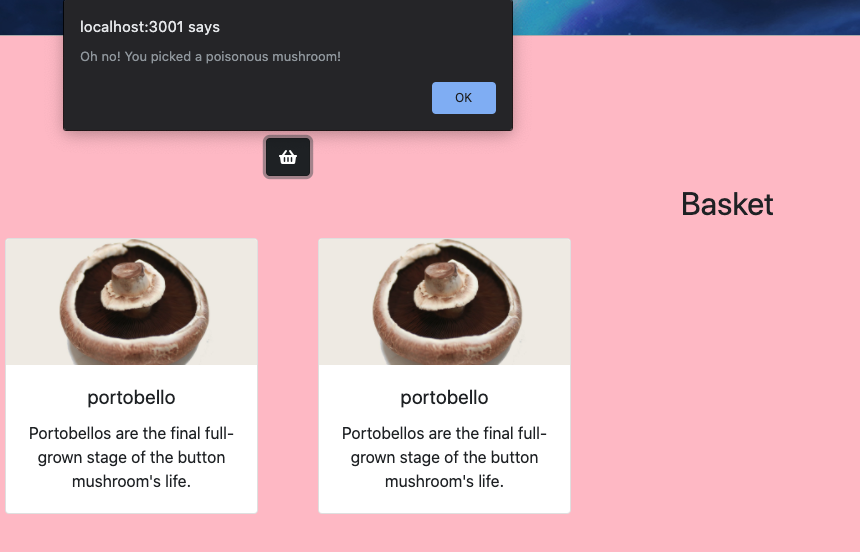
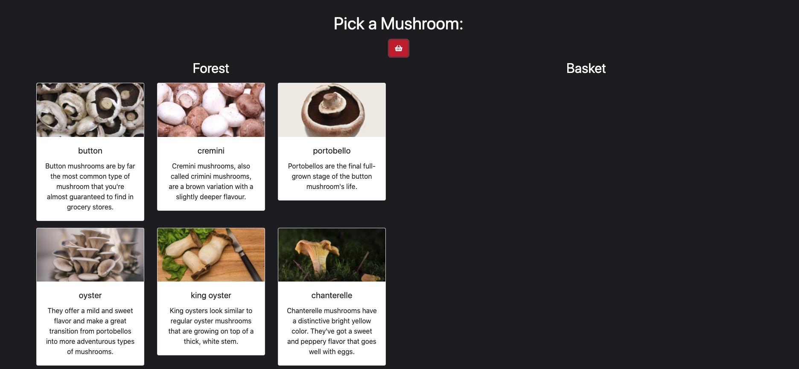
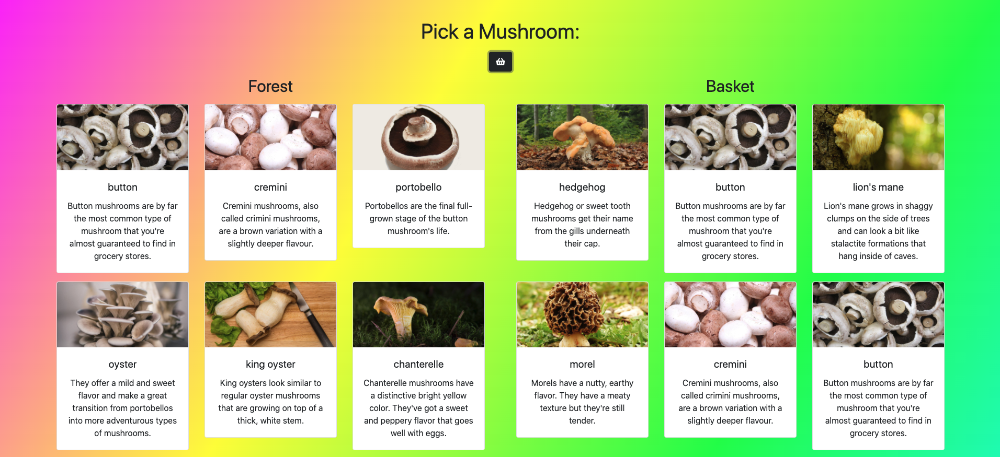

# Mushroom Picker

## Description
This project was used as an introduction to React.

In this app, mushroom data is displayed on the page. We created components to specify how the mushrooms would be displayed stylistically, importing those comonents into the main App file. 

Users can "pick" a mushroom for their basket by clicking the button at the top of the page. Depending on which mushroom is picked, those mushrooms will display on the right side of the screen in the users' basket. If the user picks a poisonous or deadly mushroom, a window alert will display a message and the app style will change to a dark mode. Selecting a non-poisonous or deadly mushroom changes the style back to normal.

If a user selects the magic mushroom, it adds all non-poisonous or deadly mushrooms to the users basket. The user can "win" by collecting at least one of each safe mushroom type or by picking the magic mushroom. When this happens, the user is alerted and the app style changes to a psychedelic color scheme.

## Screenshots
Main App View

Picked Mushrooms in the Basket

Alert when bad mushroom is picked

Dark style change after picking bad mushroom

Psychedelic style change after winning

## How to run
1. Clone this repo
1. Make sure you have http-server installed via npm. If not get it [here](https://www.npmjs.com/package/http-server)
1. On your command line, run `hs -p 9999`
1. In your browser, go to `http://localhost:9999`
